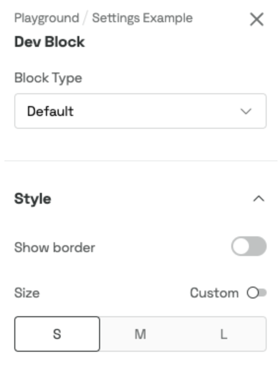
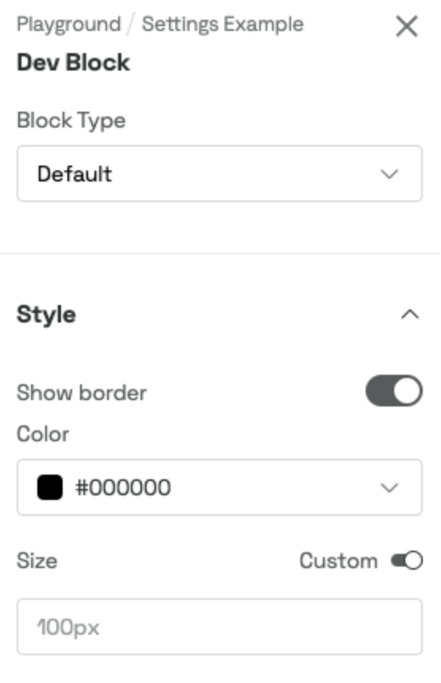

# Block Settings - How To Customize Your Blocks

Provides the block settings types for the guideline-blocks.

## Introducing Block Settings

_Block Settings_ allow you to customize the settings in the sidebar of your _Content Block_. Start by creating a `settings.ts` file in the `src` folder of your block. There are five default sections, and you can add your own custom sections.

## How to Use Sections within the Settings


<br/>

### [Sections](./types/index.ts)

| Section  | Intended use cases                                                                                                                      |
| -------- | --------------------------------------------------------------------------------------------------------------------------------------- |
| Main     | Main dropdown to select block types (disabled if only one type is available)                                                            |
| Basics   | Specific block-related settings to define the block basics, i.e., asset selection                                                       |
| Layout   | Block display options such as positioning, hiding and showing properties, content alignment, padding, and other layout-related settings |
| Style    | Adapt visual styling of blocks by changing colors, borders, line styles, corners, etc.                                                  |
| [Custom] | Any use cases that don't fit into default sections; will be displayed below the Security section                                        |
| Security | Manage access control, block visibility, etc.                                                                                           |
| Targets  | Define who can see your _Content Block (added automatically at the end)_                                                                |

---

> ⚠️ **_NOTE_**:
> Custom sections are ordered last and are displayed after the Targets section.

---

<br/>

### Example

```ts
export default {
    main: [],
    basics: [],
    layout: [],
    style: [],
    security: [],
    custom: [], // optional
};
```

## The Settings Type Object

Add _TypeScript_ support by creating a `Settings` type object according to your specific settings. The properties of the `Settings` type object correspond to the block `id`s you set in the `settings.ts`.

<br/>

### Example how to use

| Settings example with inactive switches                      | Settings example with active switches                       |
| ------------------------------------------------------------ | ----------------------------------------------------------- |
|  |  |

```ts
//types.ts

export enum BlockType {
    Default = 'Default',
    Special = 'Special',
}

export enum BlockSize {
    Small = 'Small',
    Medium = 'Medium',
    Large = 'Large',
}

export type YourBlockProps = {
    appBridge: AppBridgeBlock;
};

export type Settings = {
    blockType?: BlockType;
    showBorder?: boolean;
    color?: Color;
    isCustomSize?: boolean;
    customSize?: string;
    defaultSize?: BlockSize;
};
```

```ts
//settings.ts

const settings: BlockSettings = {
    main: [
        {
            id: 'blockType',
            type: 'dropdown',
            label: 'Block Type',
            defaultValue: BlockType.Default,
            choices: [
                {
                    value: BlockType.Default,
                    label: 'Default',
                },
                {
                    value: BlockType.Special,
                    label: 'Special',
                },
            ],
        },
    ],
    style: [
        {
            id: 'showBorder',
            type: 'switch',
            label: 'Show border',
            defaultValue: false,
            on: [
                {
                    id: 'color',
                    label: 'Color',
                    type: 'colorInput',
                    defaultValue: { hex: '#00000' },
                },
            ],
        },
        {
            id: 'isCustomSize',
            label: 'Size',
            type: 'switch',
            switchLabel: 'Custom',
            defaultValue: false,
            on: [
                {
                    id: 'customSize',
                    type: 'input',
                    placeholder: '100px',
                    rules: [numericalOrPixelRule],
                },
            ],
            off: [
                {
                    id: 'defaultSize',
                    type: 'slider',
                    defaultValue: BlockSize.Small,
                    choices: [
                        {
                            label: 'S',
                            value: BlockSize.Small,
                        },
                        {
                            label: 'M',
                            value: BlockSize.Medium,
                        },
                        {
                            label: 'L',
                            value: BlockSize.Large,
                        },
                    ],
                },
            ],
        },
    ],
};

export default settings;
```

```ts
// YourBlock.tsx

export const YourBlock: FC<YourBlockProps> = ({ appBridge }) => {
		const [blockSettings] = useBlockSettings<Settings>(appBridge);

		const {
				blockType = BlockType.Default,
				showBorder = false,
				color = { hex: '#00000' },
				isCustomSize = false,
				customSize = '',
				defaultSize = BlockSize.Small,
		} = blockSettings;

		...
}
```

## Please check out this repository for more informations on:

-   Different Block Types
-   Conditional Settings
-   Hiding & Showing Block Settings Conditionally
-   Reacting on Change
-   Store Arbitrary Data
-   Validating Block Settings

# Store Arbitrary Data

The _Content blocks_ allow you to store any type of data (as long as it’s a JavaScript type). The way this is done is by accessing `blockSettings` from the content block and saving our data as a property on that object:

```ts
const [blockSettings, setBlockSettings] = useBlockSettings<Settings>(appBridge);

...

const someTypeOfData = {
	foo: 42,
	bar: ['one', 'two', 'three']
};

...

setBlockSettings({ myCustomData: someTypeOfData });
```

Retrieval of the data is done by accessing the property directly on the settings object:

```ts
blockSettings.myCustomData.foo; // 42
```
