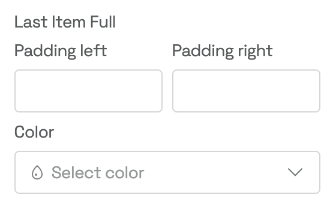

# Block Settings - How To Customize Your Blocks

Provides the block settings types for the guideline-blocks.

## Introducing Block Settings

_Block Settings_ allow you to customize the settings in the sidebar of your _Content Block_. Start by creating a `settings.ts` file in the `src` folder of your block. There are five default sections, and you can add your own custom sections.

## How to Use Sections within the Settings


<br/>

### [Sections](./types/index.ts)

| Section  | Intended use cases                                                                                                                      |
| -------- | --------------------------------------------------------------------------------------------------------------------------------------- |
| Main     | Main dropdown to select block types (disabled if only one type is available)                                                            |
| Basics   | Specific block-related settings to define the block basics, i.e., asset selection                                                       |
| Layout   | Block display options such as positioning, hiding and showing properties, content alignment, padding, and other layout-related settings |
| Style    | Adapt visual styling of blocks by changing colors, borders, line styles, corners, etc.                                                  |
| [Custom] | Any use cases that don't fit into default sections; will be displayed below the Security section                                        |
| Security | Manage access control, block visibility, etc.                                                                                           |
| Targets  | Define who can see your _Content Block (added automatically at the end)_                                                                |

---

> ⚠️ **_NOTE_**:
> Custom sections are ordered last and are displayed after the Targets section.

---

<br/>

### Example

```ts
export default {
    main: [],
    basics: [],
    layout: [],
    style: [],
    security: [],
    custom: [], // optional
};
```

# The Settings Type Object

Add _TypeScript_ support by creating a `Settings` **type** object according to your specific settings. The properties of the `Settings` type object correspond to the block `id`s you set in the `settings.ts`.

<br/>

## Examples how to use types in your settings file

Properties:
|name| description|example|
|---|--|--|
|`id`|Unique ID used to save the settings|
|`show: (bundle: Bundle) ⇒ boolean` | Defines the visibility based on other setting values or conditions|`show: (bundle: Bundle) => bundle.getBlock('switchId')?.value === true,` (only show setting if switch is active) <br/> `show: (bundle: Bundle) => bundle.getBlock('mainDropdownId')?.value === 'SpecialVariant',` (only show setting if SpecialVariant is selected in the main dropdown)|
| `onChange: (bundle: Bundle) ⇒ void`|Allow value alteration before saving| `(bundle: Bundle) => bundle.setBlockValue('height', '50px'),`
`rules: []`| You may add validation rules to your Block Settings using the rules array.| `errorMessage: 'Can not be empty',`<br/>` validate: (value: string) => + value.length > 0,`

Diverse:

-   `bundle.getBlock()`: You can access a Block Setting’s value by using the getBlock() function, which takes the id of the target Block Setting as a parameter. (see above example in `show`)
-   Conditional Settings: Use the `on` and `off` properties in the switch setting to hide or display specific settings based on the switch value.

> See simple example in this repository:<br/> [ExampleBlock.tsx](./../example/src/ExampleBlock.tsx)<br/> [settings.ts](./../example/src/settings.ts)<br/> [index.tsx](./../example/src/index.tsx)

<br/>

> ## See all types [here](./../block-settings/types/blocks/index.ts)

<br/>

## Asset Input

> [Type](./../block-settings/types/blocks/assetInput.ts): `assetInput`


```ts
import { FileExtension } from '@frontify/app-bridge';

{
    id: 'assetInputId',
    label: 'Asset Input',
    type: 'assetInput',
    extensions: [FileExtension.Png, FileExtension.Jpg],
},
```

## Checklist

> [Type](./../block-settings/types/blocks/checklist.ts): `checklist`


```ts
{
    id: 'checklistId',
    label: 'Checklist',
    type: 'checklist',
    defaultValue: ['item-1'],
    choices: [
        {
            id: 'item-1',
            label: 'First item',
        },
        {
            id: 'item-2',
            label: 'Second item',
        },
        {
            id: 'item-3',
            label: 'Third item',
        },
    ],
},
```

## Color Input

> [Type](./../block-settings/types/blocks/colorInput.ts): `colorInput`


```ts
{
    id: 'colorInputId',
    label: 'Color Input',
    type: 'colorInput',
    defaultValue: {
        red: 255,
        green: 0,
        blue: 0,
        alpha: 1,
        name: 'Red',
    },
},
```

## Dropdown

> [Type](./../block-settings/types/blocks/dropdown.ts): `dropdown`


```ts
{
    id: 'dropdownId',
    type: 'dropdown',
    label: 'Dropdown',
    defaultValue: 'grid',
    choices: [
        {
            value: 'grid',
            icon: IconEnum.GridRegular,
            label: 'Grid',
        },
        {
            value: 'horizontal',
            icon: IconEnum.StackHorizontal,
            label: 'Horizontal',
        },
        {
            value: 'vertical',
            icon: IconEnum.StackVertical,
            label: 'Vertical',
        },
    ],
},
```

## Input

> [Type](./../block-settings/types/blocks/input.ts): `input`


```ts
{
    id: 'inputId',
    type: 'input',
    label: 'Input',
    defaultValue: '100px',
    placeholder: 'e.g. 12px',
    clearable: true,
    rules: [
        {
            errorMessage: "Please use a numerical value with or without 'px'",
            validate: (value: string) => value.match(/^\d+(?:px)?$/g) !== null,
        }
    ],
},
```

## Multi Input

> [Type](./../block-settings/types/blocks/multiInput.ts): `multiInput` <br/> (`layout: MultiInputLayout.Columns`(left), `layout: MultiInputLayout.Spider` (middle), `lastItemFullWidth: true` (right))

  

```ts
{
    id: 'multiInputId',
    type: 'multiInput',
    label: 'Multi Input',
    layout: MultiInputLayout.Columns,
    blocks: [
        {
            id: 'topLeft',
            type: 'input',
            label: 'Top left',
        },
        {
            id: 'topRight',
            type: 'input',
            label: 'Top right',
        },
        {
            id: 'bottomLeft',
            type: 'input',
            label: 'Bottom left',
        },
        {
            id: 'bottomRight',
            type: 'input',
            label: 'Bottom right',
        },
    ],
},
```

## Slider

> [Type](./../block-settings/types/blocks/assetInput.ts): `slider`

 

```ts
// slider with text (left image)
{
    id: 'sliderId',
    type: 'slider',
    label: 'Slider',
    defaultValue: 'small',
    helperText: 'This is a helper text.',
    choices: [
        {
            value: 'small',
            label: 'S',
        },
        {
            value: 'medium',
            label: 'M',
        },
        {
            value: 'large',
            label: 'L',
        },
    ],
},
```

```ts
// slider with icons (right image)

{
    ...
    choices: [
        {
            value: 'left',
            icon: IconEnum.TextAlignmentLeft,
        }
    ]
}
```

## Switch

> [Type](./../block-settings/types/blocks/assetInput.ts): `switch`

  

```ts
// left image
{
    id: 'switchId',
    type: 'switch',
    label: 'Switch',
    defaultValue: false,
}

```

```ts
// advanced switch with switchLabel: 'Custom' (middle & right)
{
    id: 'switchId',
    type: 'switch',
    label: 'Switch',
    switchLabel: 'Custom',
    defaultValue: false,
    off: [
        {
            id: 'sliderId',
            type: 'slider',
            defaultValue: 'small',
            choices: [
                {
                    value: 'small',
                    label: 'S',
                },
                {
                    value: 'medium',
                    label: 'M',
                },
                {
                    value: 'large',
                    label: 'L',
                },
            ],
        },
    ],
    on: [
        {
            id: 'inputId',
            type: 'input',

            defaultValue: '100px',
            clearable: true,
        },
    ],
},
```

<br/>

# Store Arbitrary Data within your Block

The _Content blocks_ allow you to store any type of data (as long as it’s a JavaScript type). The way this is done is by accessing `blockSettings` from the content block and saving our data as a property on that object:

```ts
const [blockSettings, setBlockSettings] = useBlockSettings<Settings>(appBridge);

...

const someTypeOfData = {
	foo: 42,
	bar: ['one', 'two', 'three']
};

...

setBlockSettings({ myCustomData: someTypeOfData });
```

Retrieval of the data is done by accessing the property directly on the settings object:

```ts
blockSettings.myCustomData.foo; // 42
```
