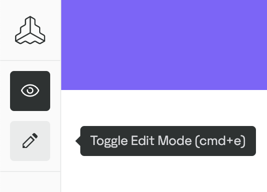
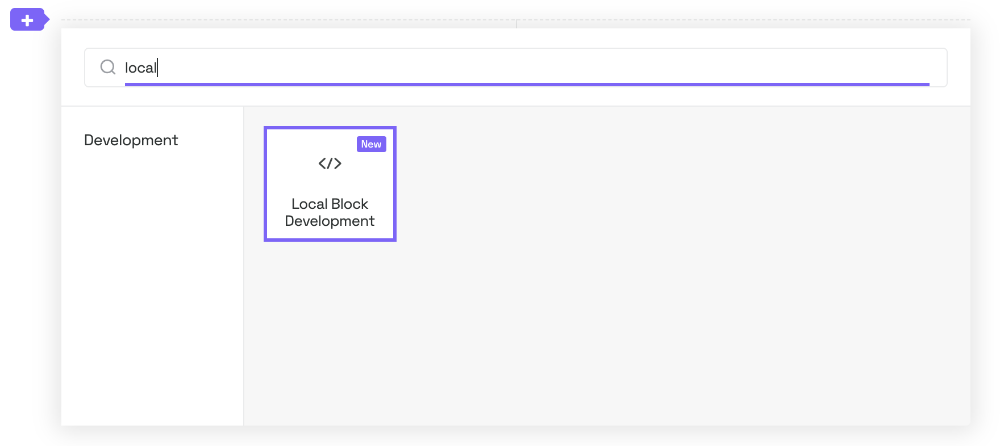

# Guideline Blocks

## Local block development

### Requirements:

- Node 24
- [pnpm 10](https://pnpm.io/installation)
- Access to a Frontify guideline

### Setup

1. Clone this repository
    ```
    $ git clone git@github.com:Frontify/guideline-blocks.git
    ```
2. Install the dependencies
    ```
    $ pnpm install
    ```
3. Create a build of the utilities
    ```
    $ pnpm build
    ```
4. Serve a block
    ```
    $ cd packages/<block name>
    $ pnpm serve
    ```
5. Go to your Frontify guideline
6. Switch to edit mode
   
7. Click on the plus icon and add a "Local Block Development" block
   
8. Choose port (default is 5600) and click OK
