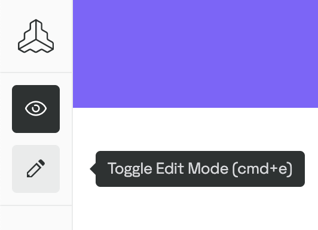

# Guideline Blocks

## Local block development

### Requirements:

-   Node 16
-   [pnpm 7](https://pnpm.io/installation)
-   Access to a Frontify styleguide

### Setup

1. Clone this repository
    ```
    $ git clone git@github.com:Frontify/guideline-blocks.git
    ```
2. Install the dependencies
    ```
    $ pnpm install
    ```
3. Start your block.
    ```
    $ pnpm --filter packages/example serve
    ```
4. Go to your Frontify styleguide
5. Switch to edit mode
   
6. Click on the plus icon and add a "Local Block Development" block
   
7. Choose port (default is 5600) and click OK

### Create a new release of block settings types

Use `npm run publish:block-settings` to create a new version.
