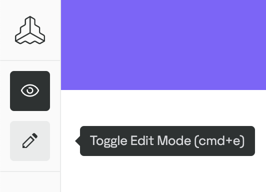
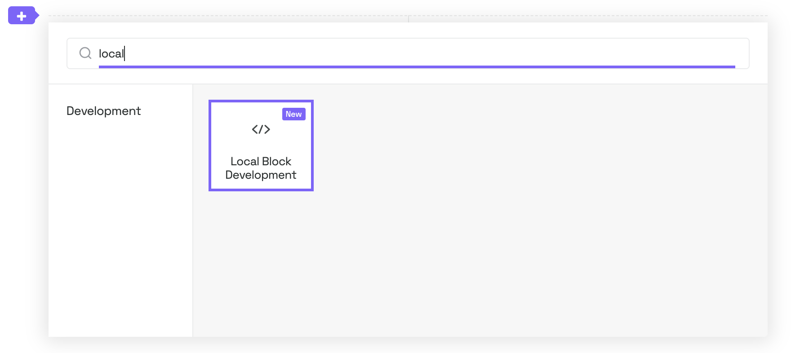

# Guideline Blocks

## Local block development

### Requirements:

- Node 26
- [pnpm 11](https://pnpm.io/installation)
- Access to a Frontify guideline

### Setup

1. Clone this repository
    ```
    $ git clone git@github.com:Frontify/guideline-blocks.git
    ```
2. Install the dependencies
    ```
    $ pnpm install
    ```
3. Create a build of the utilities
    ```
    $ pnpm build
    ```
4. Serve a block
    ```
    $ cd packages/<block name>
    $ pnpm serve
    ```
5. Go to your Frontify guideline
6. Switch to edit mode
   
7. Click on the plus icon and add a "Local Block Development" block
   
8. Choose port (default is 5600) and click OK

## Releasing

Merging to `main` deploys and publishes every affected block to the Frontify Marketplace.
There are no version numbers to bump -- the marketplace tracks its own version per app, and
this repo tracks only what was last published, as one `released/<block>` git tag each.

Most merges need nothing from you: change detection picks the blocks up and falls back to
the commit subjects for the changelog. Add an entry when you want to write the changelog
yourself, or force blocks into the release that the diff would miss:

```sh
cd packages/audio-block && pnpm release   # this block
pnpm release                              # repo root: one changelog, every block
pnpm release:plan                         # preview what the next merge would publish
```

See [`.releases/README.md`](./.releases/README.md) for the entry format and the full
selection rules.
